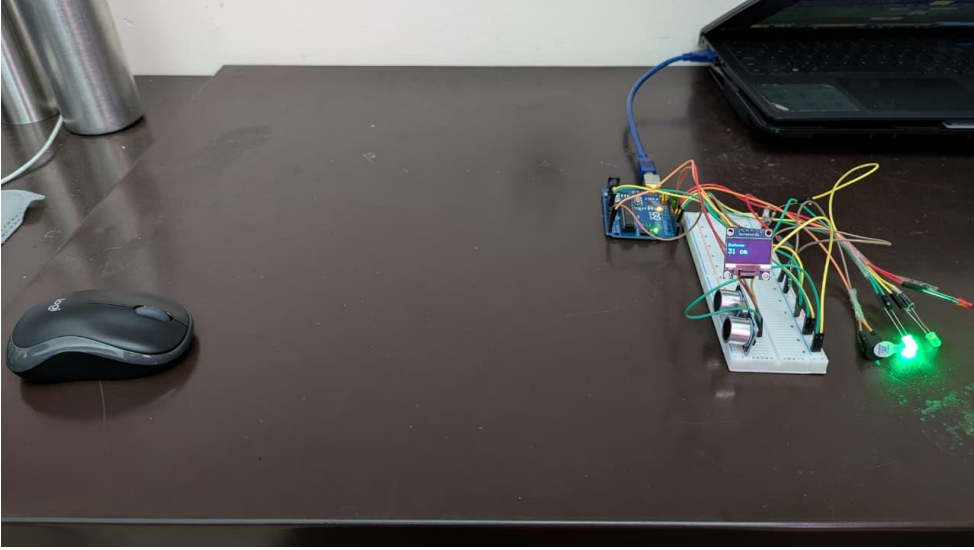
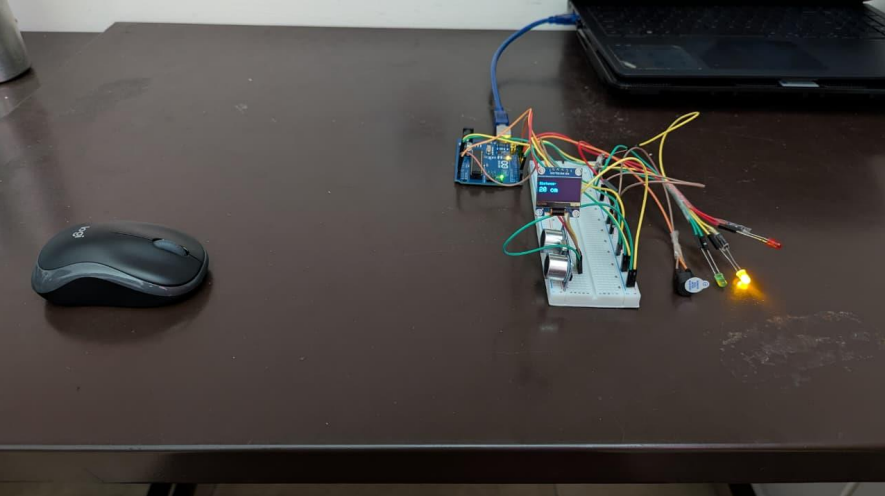
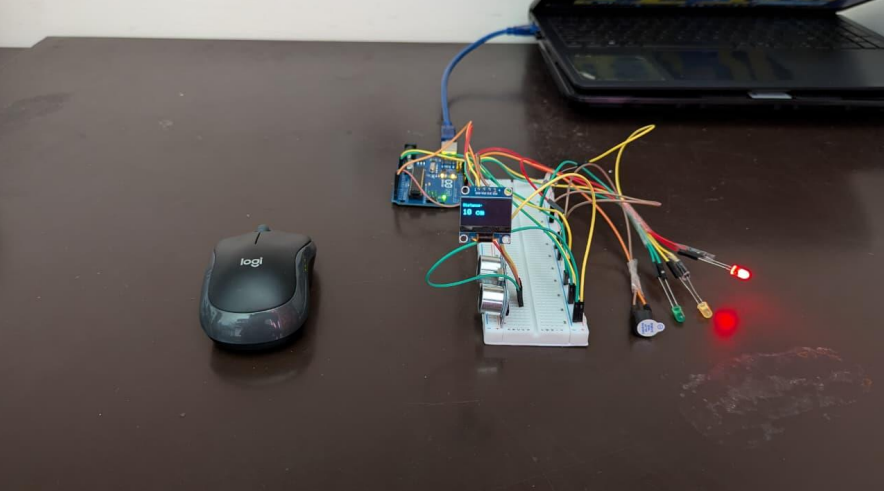

# Ultrasonic Distance Measurement with Alert System

## Overview

This project measures the distance of nearby objects using an HC-SR04 Ultrasonic Sensor and displays the measured distance on an OLED display. The system provides visual and audio alerts when an object comes within a specified range.

## Features

- Real-time distance measurement
- OLED display output
- Green LED for safe distance
- Yellow LED for medium distance
- Red LED and buzzer for close objects
- Arduino-based implementation

## Components Used

- Arduino Uno
- HC-SR04 Ultrasonic Sensor
- OLED Display (0.96")
- LEDs (Red, Yellow, Green)
- Buzzer
- Breadboard
- Jumper Wires
- Resistors

## Working Principle

The ultrasonic sensor transmits sound waves and measures the time taken for the echo to return. The Arduino calculates the distance and activates LEDs or the buzzer based on predefined distance thresholds.

## Technologies Used

- Arduino IDE
- Embedded Systems
- Sensor Interfacing
- Tinkercad

## Applications

- Parking Assistance Systems
- Obstacle Detection in Robotics
- Industrial Safety Systems
- Blind Assistance Devices

## Project Demonstration

### Green LED (Safe Distance)

### Yellow LED (Medium Distance)

### Red LED and Buzzer (Danger Zone)

## Author

D Subham Kumar
